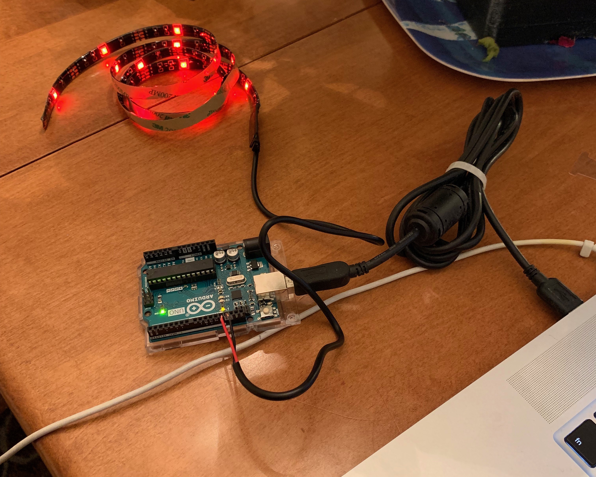

# Automatic Plant Grower

The purpose of this project is to build a plant grower than can do all the work automatically. There are a series of more complex features we are looking to add, but the MVP is to get the plant to self-light and self-water.

## Process

### 1. Build  the case

The case is a rectangle with an open top (so the plant can grow out of it). The four sides are glass and the bottom is acrylic. It is held together via silicone.

### 2. Leak Test

It leaked :) so I had to add more silicone (a couple of times, whoops)

### 3. Test the board

I bought some cheap LEDs to test out the Arduino Uno, since we are going to be later using appropriate LEDs to grow the plant.

